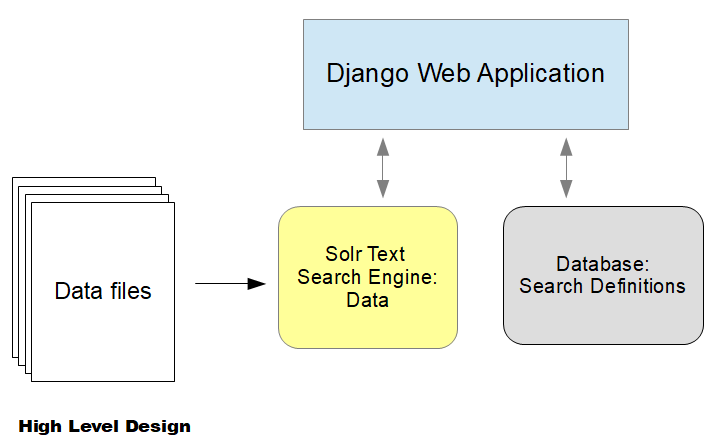

# Open Canada Search 2 (OCS2)


## About

Open Canada Search 2 (OCS) is a Django 5.x application that uses Solr 9.x to provide a customizable search interface
for the Open Canada data catalog and Canadian proactive disclosure data.

The search application provides a variety of features:
 - It supports Englisn and French specific text searching as well as [Boolean searching](./docs/Searching.md),
 - All searches use the [Canada.ca look and feel](https://wet-boew.github.io/v4.0-ci/index-en.html),
 - Individual searches can be intensely customized using Django's web templates and a custom plug-in system
 - Search results can be downloaded into expanded CSV files
 - Custom facet searches

## Getting Started

### System Requirements

OCS is written in python. Developers should be familiar with python (version 3.9 or higher) and using python vitrual 
environments created using pip or similar tools. Python library requirements are listed in the [requirements.txt](https://github.com/open-data/oc_search/blob/master/requirements.txt) file.

#### Django 
OCS is built with the [Django 5.x framework](https://www.djangoproject.com/), and can run on Windows and Linux python 
virtual environments.

Django is built with Python 3. Version 3.9 or higher of python is supported but version 3.12 or higher is recommended. For more information, see the [Django project pages](https://docs.djangoproject.com/en/5.2/intro/install/). OCS has been tested on both Windows 10 and 11 and RHEL 8.

It is highly recommended that users have some basic familiarity with Django before installing OCS2.

#### Postgresql

OCS requires a database backend that is supported by Django such as PostgreSQL 16. Initial development can be done with the SQLite engine that is included with Python. OCS uses the Django ORM model and is installed using the standard Django database commands.

#### Solr

OCS also requires Solr v9.x. For information on installing Solr, please visit the
[Apache Solr Reference Guide](https://lucene.apache.org/solr/guide/).

#### Celery 

Background data processing is required for downloading search results. OCS uses [Celery](https://docs.celeryq.dev/en/stable/getting-started/introduction.html). and Django extenion [Celery for Django](https://docs.celeryq.dev/en/stable/django/first-steps-with-django.html). Both [Celery](https://docs.celeryq.dev/en/stable/getting-started/introduction.html#get-started) and [Celery-for-Django](https://docs.celeryq.dev/en/latest/django/first-steps-with-django.html#django-celery-results-using-the-django-orm-cache-as-a-result-backend) need to be set up prior to downloading search results.

### Django Extensions

[Django extensions](https://docs.djangoproject.com/en/5.2/topics/external-packages/) are re-usable code modules [provided by third party developers](https://djangopackages.org/) that provide additional
functionality to Django. The Django core project comes with several contributed modules which are
used by OCS. It also uses several well-known plugins provided by third party developers. The python modules for
these extensions are included in the project's requirements.txt file.

1. [Django CORS Headers](https://github.com/adamchainz/django-cors-headers) A Django App that adds Cross-Origin Resource Sharing (CORS) headers to responses. This allows in-browser requests to your Django application from other origins.
2. [Django Jazzmin Admin Theme](https://django-jazzmin.readthedocs.io/) Provides a more modern Ui for the Django admin interface
3. [Django QUrl Template Tag](https://github.com/sophilabs/django-qurl-templatetag) A Django template tag to modify url's query string
4. [Django Celery Beat](https://github.com/celery/django-celery-beat) This extension enables you to store the periodic task schedule in the database.
   The periodic tasks can be managed from the Django Admin interface, where you can create, edit and delete periodic tasks and how often they should run.
5. [Django Celery Results](https://github.com/celery/django-celery-results)  This extension enables you to store Celery task results using the Django ORM.
6. [Django Timezone Field](https://pypi.org/project/django-timezone-field/) A Django app providing DB, form, and REST framework fields for [`zoneinfo`](https://docs.python.org/3/library/zoneinfo.html) and [`pytz`](http://pypi.python.org/pypi/pytz/) timezone objects.

These Django plugins are enabled in the Django application's settings.py file. Example configuration can be found in
[settings-sample.py](https://github.com/open-data/oc_search/blob/master/oc_search/settings-sample.py)

## Installing from Source

Before installing OCS2, set up the prerequisites listed in [Getting Started](https://github.com/open-data/oc_search#system-requirements):

- Python 3.9+
- PostgreSQL 16 (recommended) or other Django supported database
- Apache Solr Search Server 9.x

For production instances use a uWSGI server like uWSGI or Gunicorn

### Steps

Before downloading code and setting up your virtual environment, choose an appropriate directory like
`/opt/tbs/search`. Use of a dedicated non-privileged user is also recommended for running the server in
production environments - no particular username is assumed.

1. Clone the OCS project from GitHub: https://github.com/open-data/oc_search


2. (_Recommended_) Clone the OCS custom searches from GitHub: https://github.com/open-data/oc_searches.git


3. Create a python virtual environment using Python 3.9 or higher.

   For example `python -m venv venv`.


4. Activate the new virtual environment.

   On Linux, the command is `source venv/bin/activate`. On Windows, the command `venv\Scripts\activate` where
   `venv` is the name of your virtual environment.


6. Install the OCS python library prerequisites.

   Go to the OCS2 project directory and install from the python library requirements list in the
   [requirements.txt](https://github.com/open-data/oc_search/blob/master/requirements.txt) file

   `pip install -r requirements.txt`


7. Create a Django project settings file.

   Django reads project runtime settings from a `settings.py` file located in the
   [application sub-directory](https://github.com/open-data/oc_search/tree/master/oc_search). OCS2 provides an example settings file. Use the provided
   file [settings-sample.py](https://github.com/open-data/oc_search/blob/master/oc_search/settings-sample.py) as a template for your own project.

   For more information on customizing the basic Django frameworks settings, see the
   [Django Project documentation.](https://docs.djangoproject.com/en/5.2/topics/settings/)


8. Create the Django, OCS, and Celery database tables.

   In the settings.py file set the appropriate database settings and create the database tables
   using the Django command-line management tool.
   OCS2 has been tested with PostgreSQL 13 and SqLite 3.

   - `python manage.py makemigrations search`
   - `python manage.py sqlmigrate search 0001`
   - `python manage.py migrate`


10. Downloading search results makes use of a Celery background worker that offloads the process for
   generating large CSV files that contain the data found for a given search from the main Django web
   application. To set up [Celery for Django](https://pypi.python.org/pypi/django-celery-results/) run the provided database migrations.

   - `python .\manage.py migrate django_celery_results`
   - `python .\manage.py migrate django_celery_beat`


11. (_Optional while developing_) Start the Celery workers. **Note**, in production, the Celery workers should be [daemonized](https://docs.celeryq.dev/en/stable/userguide/daemonizing.html#daemonizing).

    `celery -A oc_search worker -l INFO --pool=solo` [Windows] <br>
    `celery -A oc_search worker -l INFO` [Linux] <br><br>
    `celery -A oc_search beat -l INFO --scheduler django_celery_beat.schedulers:DatabaseScheduler`


12. Create an admin user for Django using the admin tool and answering the prompts.

    `python manage.py createsuperuser`


12. Test your installation by running Django.

    `python manage.py runserver`


### Next Steps

The Search application is a blank framework. The next steps include making custom search plugins to
create a custom interactive search application. See the [Custom Search developer documentation](./docs/Custom_searches.md).

For information on importing an existing custom search, see [Import Custom Searches](https://github.com/open-data/oc_search/blob/master/docs/import_custom_search.md)

For production, Django should be installed as a WSGI application. For instruction on doing this with
uWSGI, see the [Django Documentation](https://docs.djangoproject.com/en/3.2/howto/deployment/wsgi/uwsgi/)

### Note on Logging

OCS  has two logs, one for regular logging information and another optional one for recording search activity.
In the logging settings, be sure to set up your logging using a format similar to this:

```javascript
    'handlers': {
        'console': {
            'class': 'logging.StreamHandler',
        },
        'query_log': {
            'class': 'logging.StreamHandler',
            'formatter': 'search_term_formatter',
            'encoding': 'utf8',
        },
    },
    'formatters': {
        'search_term_formatter': {
            'format': '%(asctime)s,%(message)s',
            'datefmt': '%Y-%m-%dT%H:%M:%SZ'
        }
    },
    'loggers': {
        'search_term_logger': {
            'handlers': ['query_log'],
            'level': 'INFO',
            'propagate': False,
        },
    },
    'root': {
        'handlers': ['console'],
        'level': 'INFO',
    },
```

The search query log needs to be in a specific format so that the custom `import_query_logs` command can load the
log file into the database where it can be processed. Logs will accumulate over time, so be sure to set up an information management policy for managing the logs.


## Automated Testing

OCS comes with a basic end-to-end test suite that employs Playwright. See [Tests](./docs/Test.md) for more information.

---

# Overview

OCS is made of several components including:

1. The Django web application that provides the search and administration web interfaces. The
   [Django framework](https://www.djangoproject.com/) is a general purpose web application framework written in Python and is well supported.
2. A relational database backend supported by Django. The database is used to hold routing, messaging,
   search definitions, and other permanent data. OCS2 has been tested with PostgreSQL 13.
3. An [Apache Solr](https://lucene.apache.org/solr/) text search engine that provides the semantic search engine. OCS2 uses the
   [SolrClient](https://github.com/open-data/SolrClient) library to both query with Solr and dynamically
   create search cores on the Solr server.
4. A Celery background worker




## Database

Each search definition is made of three or four components:

1. **Search**: General information about the search such as labels and Solr core name
2. **Fields**: Each search consists of a number of individual fields. Each field record is associated with a single Search record
   and contains metadata describing the field such as the data type and labels.
3. **Codes** and code values (_optional_). Often structured data will contain code values or 'lookup' fields values where the
   field value must come from a predetermined list of values. For example, 'AB' maybe selected from a list of Canadian provincial
   acronyms. Each row in the table represents a single code value and is associated with a single field.
4. **ChronologicCodes**: These are similar to codes, but have a start and end date time associated with a code value. This permits
   the Englisn and French values of the codes to be associated with a specific time range. These fields are used for very 
   specific proactive disclosure types where the the code value changes over time for a given value. To date, these have only
   been user for the names of Ministers of the government.

Combined, these three components, Search, Fields, and Codes, define a custom search application.
Django provides an administrative user interface for editing the search definitions. To use,
[create an admin account](https://docs.djangoproject.com/en/5.2/intro/tutorial02/#creating-an-admin-user), and
[login to the admin system](https://docs.djangoproject.com/en/5.2/intro/tutorial02/#enter-the-admin-site).
The OC Search admin screens have been modified with helpful customizations to make it easier to
customize a search.

Tha actual search data is not stored in the relational database, but is stored only in the Solr search engine. The
database contains the metadata model of the search application which _describes_ the formant of the data that is searched,
and the search interface,

Importing and exporting of search definitions is done using custom Django management commands..


## OCS Commands

Several custom Django management commands are available

<div id="create_solr_core">

### create_solr_core

To run: `python manage.py create_solr_core --search <search name>`

`<search name` Is the name of a search that has been  defined either by running a load script or
through the Django admin UI.

</div>

<div id="import_schema_ckan_yaml">

### (Unsupported) import_schema_ckan_yaml

__Please note that this commond no longer works with newer versions of CKAN or Search__

To run: `python manage.py import_schema_ckan_yaml --yaml_file <yaml file> --search_id <unique search ID> --title_en <English Title> --title_fr <French Title> [--reset]`

This command will parse the CKAN YAML file and load it into the search model database

</div>

<div id="import_data_csv">

### import_data_csv

This command is used to load Proactive Disclosure and other CSV style data into a search core.

To run: `python manage.py import_date_csv --csv <CSV file> --search <Unique search ID> [--nothing_to_report]`

</div>

---

# Plugin API Changes

## Version 1.1

Added two new API functions that are called just before the search page is rendered and just before the record page is rendered:

```python
def pre_render_search(context: dict, template: str, request: HttpRequest, lang: str, search: Search, fields: dict, codes: dict):

def pre_render_record(context: dict, template: str, request: HttpRequest, lang: str, search: Search, fields: dict, codes: dict):
```

## Version 1.2

`pre_render_search()` function updated to include a view-type parameter, that allows rendering to differentiate between views like
Search and More-Like-This
```python
def pre_render_search(context: dict, template: str, request: HttpRequest, lang: str, search: Search, fields: dict, codes: dict, view_type='search'):
```

