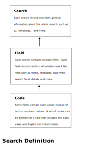

# Open Canada Solr Search #

[](https://badges.pufler.dev)

Open Canada Solr Search (OCS) is a Django 3.0 application that uses Solr 8.x to provide a customizable search interface
for the Open Canada data catalog and the proactive disclosure data. OCS provides a standard web interface into Solr cores 
.


## Installing OCS from Source

### System Requirements

OCS is built with the [Django 3.x framework](https://www.djangoproject.com/), and can run in any environment capable of supporting Django 3.x
which is built with Python 3. Version 3.6 or higher is recommended. For more details, see the [Django project
pages](https://docs.djangoproject.com/en/3.1/intro/install/). OCS has been tested on both Windows 10 and CentOS/RHEL 7.
It is highly recommended that users have some basic familiarity with Django before using OCS.

OCS requires a database backend that is supported by Django such as PostgreSQL or MySQL. Initial development can be done with the SQLite engine
that is included with Python. 

OCS also requires access to a Solr server. For information on installing Solr, please visit the 
[Apache Solr Reference Guide](https://lucene.apache.org/solr/guide/).

### Installation Steps ###

1. Clone the OCS project from GitHub: https://github.com/open-data/oc_search

1. Clone the SolrClient project from GitHub: https://github.com/open-data/SolrClient

1. Create a python virtual environment using Python 3.6 or higher.
   
   For example `python -m venv venv`.
   
1. Activate the new virtual environment. 

   For example `source venv/bin/activate` on Linux, or `venv\Scripts\activate` for Windows

1. Install the prerequisites from the requirements.txt file for the SolrClient project. and install the
project itself.
   
     `pip install -r requirements.txt`
   
     `python setup.py develop`

1. Install the prerequisites from the requirements.txt file for the OCS project

    `pip install -r requirements.txt`

1. Edit the settings.py file with the appropriate database settings and create the database tables

    `python manage.py makemigrations search`<br>
    `python manage.py sqlmigrate search 0001`<br>
    `python manage,py migrate`

### Django Plugins ###

Two Django plugins are used:

1. [Django import/export](https://django-import-export.readthedocs.io/en/latest/)  Django application and library for importing and exporting data with included admin integration.
1. [Django Jazzmin Admin Theme](https://django-jazzmin.readthedocs.io/) *(Optional)* Provides a more modern Ui for the Django admin interface

These Django plugins are enabled in the Django application's settings.py file. Example configuration can be found in 
[settings-sample.py](https://github.com/open-data/oc_search/blob/master/oc_search/settings-sample.py)

---

# Overview #

OCS is made of 3 components:
1. A relational database like SQLite or PostgreSQL that stores the search definitions
1. The Django-based web application that provides the search and administration web interface
1. A [Solr](https://lucene.apache.org/solr/) text search engine that provides the semantic search functionality.


## Database ##

Each search definition is made of three components:
1. **Search**: General information about the search such as labels and Solr core name
1. **Fields**: Each search consists of a number of individual fields. Each field record is associated with a single Search record
   and contains metadata describing the field such as the data type and labels.
1. **Codes** and code values (_optional_). Often structured data will contain code values or 'lookup' fields values where the
   field value must come from a predetermined list of values. For example, 'AB' maybe selected from a list of Canadian provincial 
   acronyms. Each row in the table represents a single code value and is associated with a single field. 

Combined, these three components, Search, Fields, and Codes, define a custom search application. 
Django provides an administrative user interface for editing the search definitions. To use, 
[create an admin account](https://docs.djangoproject.com/en/3.1/intro/tutorial02/#creating-an-admin-user), and 
[login to the admin system](https://docs.djangoproject.com/en/3.1/intro/tutorial02/#enter-the-admin-site). 
The OC Search admin screens have been modified with helpful customizations to make it easier to 
customize a search.

Note tha actual search data is not stored in the relational database, but is stored only in the Solr search engine. The
database contains the metadata model of the search application which _describes_ the formant of the data that is searched,
and the search interface,


### Generating a Search from CKAN yaml ###

Creating a new search from scratch can be laborious. There are two command line utilities that can be used to
generate new search definitions from existing data sources. 
One works with the CKAN yaml files that are used by Open Canada's proactive disclosure system, 
and another that createa a simple search derives from a basic search from a  generic CSV files with a header.

Use the custom **import_schema_ckan_yaml** Django command to create a new search definition based on a schema defined
in a CKAN scheming yaml file.

For example: 

`python manage.py import_schema_ckan_yaml --yaml_file .\data\travela.yaml --search_id travela --title_en "Travel Expenses" --title_fr "Dépenses de voyage gouvernementaux"`

### Generate for CSV ###

Use the custom **generic_csv_schema** Django command to create a simple search definition based on an existing CSV files with headers.

For example:

`python manage.py generic_csv_schema --csv_file tpsgc-pwgsc_ao-t_a.csv --search_id tendernotices --title_en "Tender Notices" --title_fr "Appels d'offres"`

## OCS Commands ##

Several custom Django management commands are available  

<div id="create_solr_core">
   
### create_solr_core ### 

To run: `python manage.py create_solr_core <search name>`

`<search name` Is the name of a search that has been  defined either by running a load script or
through the Django admin UI.
</div>

<div id="import_schema_ckan_yaml">
   
### import_schema_ckan_yaml ###

To run: `python manage.py import_schema_ckan_yaml --yaml_file <yaml file> --search_id <unique search ID> --title_en <English Title> --title_fr <French Title> [--reset]`

This command will parse the CKAN YAML file and load it into the search model database
</div>

<div id="import_data_csv">
   
### import_data_csv ###

To run: `python manage.py --csv <CSV file> --search <Unique search ID> --core <Solr Core Name> [--nothing_to_report]`
</div>

---

# Creating a New Search #

Creating a new proactive disclosure search requires several steps

1. Create a new blank Solr core and copy in the synonym files
2. Create a search model by importing the CKAN recombinant Yaml file using the `import_schema_ckan_yaml` command
3. Customize the Solr core schema for the seacrh model using the `create_solr_core` command
4. Import the data from the proactive disclosure CSV file using the `import_data_csv` command

## Step 1 - Create a new Solr core ##

Using Solr 8.x, create a new Solr core from the command line using the `solr` command, and copy the 
custom synonyms files to the new Solr core's configuration folder.

Example:

``` 
sudo -u solr /opt/solr/bin/solr create -c search_core1
cp oc_search/solr/conf/synonyms_*.txt /var/solr/data/search_core1/conf/lang/
```

After copying the synonym text files to the new Solr core<s language configuration directory, restart Solr
or reload the new core in order to activate the new configuration files.

## Step 2 - Create a search model ##

The search model consists of three components: search, fields, and codes (optional).



It is possible to create a new search module using the Django admin UI, but this would
be laborious and error prone. Instead, there are two custom commands that can be used to 
create new searches based on either an existing CKAN Recombinant YAML file or from a 
basic CSV file with a header. See <a href="#import_schema_ckan_yaml">import_schema_ckan_yaml</a> and 
`generic_csv_schema` commands for details.

## Step 3 - Set up Solr Core/Collection schema ##

In order to take advantage of the language features of Solr, the search application requires
that the search core use a schema. OCS is able to use Solr's dynamic schema functionality to
create a custom schema based on the search definition. Once you have finalized the search defintion,
run <a href="#create_solr_core"> `create_solr_core`</a> command line utility.

## Step 4 - Load Search Data ##

Load CSV data into the search core using the <a href="#import_data_csv">import_data_csv</a> command.

