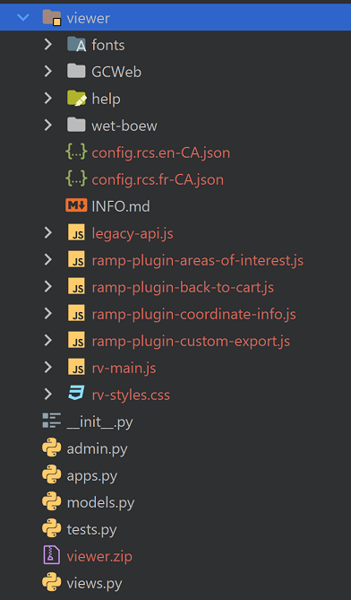

# Open Canada Search 2 (OCS2)

[](https://badges.pufler.dev)

## About

Open Canada Search (OCS2) is a Django 3.x application that uses Solr 8.x to provide a customizable search interface
for the Open Canada data catalog and the proactive disclosure data. OCS provides a standard customizable web interface
with a focus on searching Solr cores.

## Installing OCS from Source

### System Requirements

OCSs is built with the [Django 3.x framework](https://www.djangoproject.com/), and can run in any environment capable of supporting Django 3.x
which is built with Python 3. Version 3.9 or higher is recommended. For more details, see the [Django project
pages](https://docs.djangoproject.com/en/3.1/intro/install/). OCS has been tested on both Windows 10 and 11 and CentOS/RHEL 7 and 8.
It is highly recommended that users have some basic familiarity with Django before installing OCS2.

OCS2 requires a database backend that is supported by Django such as PostgreSQL or MySQL. Initial development can be done with the SQLite engine
that is included with Python.

OCS2 also requires access to a Solr v8.x server. For information on installing Solr, please visit the
[Apache Solr Reference Guide](https://lucene.apache.org/solr/guide/).

For background data processing, OCS2 using [Celery for Django](https://docs.celeryq.dev/en/latest/django/first-steps-with-django.html#django-celery-results-using-the-django-orm-cache-as-a-result-backend).


### Django Extensions

[Django extensions](https://docs.djangoproject.com/en/3.2/topics/external-packages/) are re-usable code modules [provided by third party developers](https://djangopackages.org/) that provide additional
functionality to Django applications. The Django core project comes with several contributed modules which are
used by OCS2. It also uses several well-known plugins provided by third party developers. The python modules for
these extensions are included in the project's requirements.txt file.

1. [Django Cors Headers](https://github.com/adamchainz/django-cors-headers) A Django App that adds Cross-Origin Resource Sharing (CORS) headers to responses. This allows in-browser requests to your Django application from other origins.
1. [Django Jazzmin Admin Theme](https://django-jazzmin.readthedocs.io/) Provides a more modern Ui for the Django admin interface
1. [Django QUrl Template Tag](https://github.com/sophilabs/django-qurl-templatetag) A Django template tag to modify url's query string
1. [Django Celery Beat](https://github.com/celery/django-celery-beat) This extension enables you to store the periodic task schedule in the database.
   The periodic tasks can be managed from the Django Admin interface, where you can create, edit and delete periodic tasks and how often they should run.
1. [Django Celery Results](https://github.com/celery/django-celery-results)  This extension enables you to store Celery task results using the Django ORM.
1. [Django Smuggler](https://github.com/semente/django-smuggler) Django Smuggler is a pluggable application for Django Web Framework to easily dump/load fixtures via the automatically-generated administration interface

These Django plugins are enabled in the Django application's settings.py file. Example configuration can be found in
[settings-sample.py](https://github.com/open-data/oc_search/blob/master/oc_search/settings-sample.py)


### Installing OCS2

Before installing OCS2, set up the prerequisites:

- Python 3.9+
- PostgreSQL 13 (recommended) or other Django supported database
- Apache Solr Search Server 8.x

For production instances you will want a uWSGI server like uWSGI or Gunicorn


#### Steps

Before downloading code and setting up your virtual environment, choose an appropriate directory like
`/opt/tbs/search`. Use of a dedicated non-privileged user is also recommended for running the server in
production environments - no particular username is assumed.
Change to your installation directory, optionally switch to the dedicated user,
and follow these steps.

1. Clone the OCS2 project from GitHub: https://github.com/open-data/oc_search


2. Clone the SolrClient project from GitHub: https://github.com/open-data/SolrClient


3. Clone the OCS2 custom searches from GitHub: https://github.com/open-data/oc_searches.git


4. Create a python virtual environment using Python 3.6 or higher.

   For example `python -m venv venv`.


5. Activate the new virtual environment.

   On Linux, the command is `source venv/bin/activate`. On Windows, the command `venv\Scripts\activate` where
   `venv` is the name of the virtual environment.


6. Install [SolrClient library](https://github.com/open-data/SolrClient).

   Change into the SolrClient project directory and install the prerequisites from
   the `requirements.txt` file and then install the client project itself.

   `pip install -r requirements.txt`

   `python setup.py develop`


7. Install the OCS2 python library prerequisites.

   Change to the directory where OCS2 project was cloned from GitHub, then install from the
   [requirements.txt](https://github.com/open-data/oc_search/blob/master/requirements.txt) file

   `pip install -r requirements.txt`


8. Create a Django project settings file.

   Django by default with read project runtime settings from a `settings.py` file located in the
   [application sub-directory](https://github.com/open-data/oc_search/tree/master/oc_search). OCS2
   provides an example settings file. Use the provided file [settings-sample.py](https://github.com/open-data/oc_search/blob/master/oc_search/settings-sample.py) as a template
   for your own project.

   For more information on customizing the settings file, see the
   [Django Project documentation.](https://docs.djangoproject.com/en/3.2/topics/settings/)


9. Create the Django, OCS2, and Celery database tables.

   In the settings.py file set the appropriate database settings and create the database tables.
   OCS2 has been tested with PostgreSQL 13.

   - `python manage.py makemigrations search`
   - `python manage.py sqlmigrate search 0001`
   - `python manage.py migrate`

   Downloading search results makes use of a Celery background worker that offloads the process for
   generating large CSV files that contain the data found for a given search from the main Django web
   application. To set up [Celery for Django](https://pypi.python.org/pypi/django-celery-results/) run the provided database migrations.

   `python .\manage.py migrate django_celery_results` <br>
   `python .\manage.py migrate django_celery_beat`


10. Start the Celery workers. **Note**, in production, the Celery workers should be [daemonized](https://docs.celeryq.dev/en/stable/userguide/daemonizing.html#daemonizing).

    `celery -A oc_search worker -l INFO --pool=solo` [Windows] <br>
    `celery -A oc_search worker -l INFO` [Linux] <br><br>
    `celery -A proj beat -l INFO --scheduler django_celery_beat.schedulers:DatabaseScheduler`


11. Create an admin user for Django.

    `python manage.py createsuperuser`


11. Test your installation by running Django.

    `python manage.py runserver`

### Next Steps ###

The Search application is a blank framework. The next steps include making custom search plugins to
create a custom interactive search application.

For production, Django should be installed as a WSGI application. For instruction on doing this with
uWSGI, see the [Django Documentation](https://docs.djangoproject.com/en/3.2/howto/deployment/wsgi/uwsgi/)

### Installing Custom Searches

@TODO Start Here
- In Admin interfaceCreate Search, Fields, Codes
- Create Solr core
  As Solr User run these commands
  + /opt/solr/bin/solr create -c search_ati
  + cd /var/solr/data
  +  cp -Rf search_ei/conf search_ati/
  + Reload core
- Create solr core: ` python .\manage.py create_solr_core --search ati`
- load orgs
- load date
- create a snippets folderr

---

# Overview

OCS2 is made of several components including:

1. The Django web application that provides the search and administration web interfaces. The
   [Django framework](https://www.djangoproject.com/) is a general purpose web application framework written in Python and is well supported.
1. A relational database backend supported by Django. The database is used to hold routing, messaging,
   search definitions, and other permanent data. OCS2 has been tested with PostgreSQL 13.
3. An [Apache Solr](https://lucene.apache.org/solr/) text search engine that provides the semantic search engine. OCS2 uses the
   [SolrClient](https://github.com/open-data/SolrClient) library to both query with Solr and dynamically
   create search cores on the Solr server.
4. A Celery backe-end


## Database

Each search definition is made of three or four components:

1. **Search**: General information about the search such as labels and Solr core name
2. **Fields**: Each search consists of a number of individual fields. Each field record is associated with a single Search record
   and contains metadata describing the field such as the data type and labels.
3. **Codes** and code values (_optional_). Often structured data will contain code values or 'lookup' fields values where the
   field value must come from a predetermined list of values. For example, 'AB' maybe selected from a list of Canadian provincial
   acronyms. Each row in the table represents a single code value and is associated with a single field.
4. **ChronologicCodes**: These are similar to codes, but have a start and end date time associated with a code value. This permits
   the Englisn and French values of the codes to be associated with a specific time range.

Combined, these three components, Search, Fields, and Codes, define a custom search application.
Django provides an administrative user interface for editing the search definitions. To use,
[create an admin account](https://docs.djangoproject.com/en/3.1/intro/tutorial02/#creating-an-admin-user), and
[login to the admin system](https://docs.djangoproject.com/en/3.1/intro/tutorial02/#enter-the-admin-site).
The OC Search admin screens have been modified with helpful customizations to make it easier to
customize a search.

Note tha actual search data is not stored in the relational database, but is stored only in the Solr search engine. The
database contains the metadata model of the search application which _describes_ the formant of the data that is searched,
and the search interface,


Importing and exporting of search definitions is done using [Django Smuggler](https://github.com/semente/django-smuggler).

### Generating a Search from CKAN yaml

Creating a new search from scratch can be laborious. There are two command line utilities that can be used to
generate new search definitions from existing data sources.
One works with the CKAN yaml files that are used by Open Canada's proactive disclosure system,
and another that createa a simple search derives from a basic search from a  generic CSV files with a header.

Use the custom **import_schema_ckan_yaml** Django command to create a new search definition based on a schema defined
in a CKAN scheming yaml file.

For example:

`python manage.py import_schema_ckan_yaml --yaml_file .\data\travela.yaml --search_id travela --title_en "Travel Expenses" --title_fr "Dépenses de voyage gouvernementaux"`

### Generate for CSV

Use the custom **generic_csv_schema** Django command to create a simple search definition based on an existing CSV files with headers.

For example:

`python manage.py generic_csv_schema --csv_file tpsgc-pwgsc_ao-t_a.csv --search_id tendernotices --title_en "Tender Notices" --title_fr "Appels d'offres"`

## OCS Commands

Several custom Django management commands are available

<div id="create_solr_core">

### create_solr_core

To run: `python manage.py create_solr_core <search name>`

`<search name` Is the name of a search that has been  defined either by running a load script or
through the Django admin UI.

</div>

<div id="import_schema_ckan_yaml">

### import_schema_ckan_yaml

To run: `python manage.py import_schema_ckan_yaml --yaml_file <yaml file> --search_id <unique search ID> --title_en <English Title> --title_fr <French Title> [--reset]`

This command will parse the CKAN YAML file and load it into the search model database

</div>

<div id="import_data_csv">

### import_data_csv

To run: `python manage.py --csv <CSV file> --search <Unique search ID> --core <Solr Core Name> [--nothing_to_report]`

</div>

---

# Creating a New Search

Creating a new proactive disclosure search requires several steps

1. Create a new blank Solr core and copy in the synonym files
2. Create a search model by importing the CKAN recombinant Yaml file using the `import_schema_ckan_yaml` command
3. Customize the Solr core schema for the seacrh model using the `create_solr_core` command
4. Import the data from the proactive disclosure CSV file using the `import_data_csv` command

## Step 1 - Create a new Solr core

Using Solr 8.x, create a new Solr core from the command line using the `solr` command, and copy the
custom synonyms files to the new Solr core's configuration folder. The default solrconfig.xml file
generated by the solr create command does not need to be modified.

Example:

```
sudo -u solr /opt/solr/bin/solr create -c search_core1
cp oc_search/solr/conf/synonyms_*.txt /var/solr/data/search_core1/conf/lang/
```

After copying the synonym text files to the new Solr core<s language configuration directory, restart Solr
or reload the new core in order to activate the new configuration files.

## Step 2 - Create a search model

The search model consists of three components: search, fields, and codes (optional).


It is possible to create a new search module using the Django admin UI, but this would
be laborious and error prone. Instead, there are two custom commands that can be used to
create new searches based on either an existing CKAN Recombinant YAML file or from a
basic CSV file with a header. See <a href="#import_schema_ckan_yaml">import_schema_ckan_yaml</a> and
`generic_csv_schema` commands for details.

## Step 3 - Set up Solr Core/Collection schema

In order to take advantage of the language features of Solr, the search application requires
that the search core use a schema. OCS is able to use Solr's dynamic schema functionality to
create a custom schema based on the search definition. Once you have finalized the search defintion,
run <a href="#create_solr_core"> `create_solr_core`</a> command line utility.

## Step 4 - Load Search Data

Load CSV data into the search core using the <a href="#import_data_csv">import_data_csv</a> command.

# Installing the RAMP viewer *(Optional)*

By default, the [RAMP viewer](https://github.com/fgpv-vpgf/fgpv-vpgf#usage) is not enabled, and it is not required for searching. It is used by
Open Canada for visualizing [Open Maps](https://search.open.canada.ca/en/od/?od-search-col=Open%20Maps) geospatial data

To install,

1. Download the latest [RAMP viewer release from GitHub](https://github.com/fgpv-vpgf/fgpv-vpgf/releases/latest).
   Extract the contents into the `ramp/viewer` folder in the project.
2. Download [the Canada.ca design system distribution files](https://wet-boew.github.io/GCWeb/home.html) and extract
   the contents into `ramp/viewer/GCWeb`.
3. Download the non-CDN version of [the WET-BOEW design system distribution files](https://github.com/wet-boew/wet-boew/releases)
   and extract the contents into `ramp/viewer/GCWeb`.
4. Run Django's `collectstatic` command. The RAMP viewer will look for Canada.ca and WET-BOEW files in
   the path `[static url root]/ramp/`. If using Nginx oor equivalent to server static files, be sure to set this
   path up.

For [Open Maps](https://search.open.canada.ca/en/od/?od-search-col=Open%20Maps), the viewer is
using the remote configuration services (RCS). The local RCS definition files are also located in the
`ramp/viewer` folder. The provided files are specific to Open Canada.



# Plugin API Changes

## Version 1.1

Added two new API functions that are called just before the search page is rendered and just before the record page is rendered:

```python
def pre_render_search(context: dict, template: str, request: HttpRequest, lang: str, search: Search, fields: dict, codes: dict):

def pre_render_record(context: dict, template: str, request: HttpRequest, lang: str, search: Search, fields: dict, codes: dict):
```

# Debugging Celery with PyCharm on Windows

When running Celery on Windows, use the following command to start the Celery worker

```powershell
celery -A oc_search worker -l INFO --pool=solo
```

To run a separate Celery process to run scheduled tasks:

```powershell
celery -A oc_search beat -l INFO --scheduler django_celery_beat.schedulers:DatabaseScheduler
```

To debug with PyCharm, add a new python Run Configuration. Change the script path to a
module path and enter `celery`. For parameters use `-A oc_search worker -l INFO --pool=solo`
