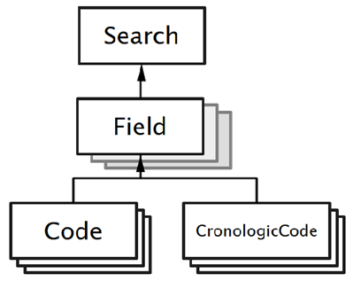

# Creating a New Proactive Disclosure Search

## Introduction ##

Custom Search definitions for Open Canada Search are made of number of components including
a database definition files, python scripts, gettext portables, HTML template snippets and more.

Before developing a custom search, be sure to set up and run the OC Search application: https://github.com/open-data/oc_search

These are the basic steps to create a new <a href="https://open.canada.ca/en/proactive-disclosure">proactive disclosure</a> search. Steps do not have to be
done in exactly this order, but most are needed.

- In the [Django Administration interface](https://docs.djangoproject.com/en/5.1/ref/contrib/admin/) create the database records that describe the Search. These
objects include:
  - Search,
  - Fields, and
  - Codes
- Create a new Solr core and copy in the custom synonym files to the core's configuration language folder. For example, to create a new Solr core for
  Contracts, as the Solr user run these commands
  ```Shell
  /opt/solr/bin/solr create -c search_contracts
  cd /var/solr/data
  cp oc_search/oc_search/solr/conf/*.txt search_contracts/conf/lang/
   ```
  Reload the Solr core using the Solr Web Admin UI. You could also restart
  the Solr service, but this can result in lost data and service disruption.


- Customize the blank Solr core based on the search model using the `create_solr_core` command:

  ` python .\manage.py create_solr_core --search contracts`

- _If a list of Canadian government departments is used in the search_, load the list of government departments using the `import_org_ckan_json` command.
- Create a code plug-in for the search that can contain python code for customizing the search.
- Load CSV data using the `import_data_csv` command.
- Create a snippets folder to hold Django template snippets to customize the appearance of the search results pages.
- Export the search definition (including all custom components) using the `export_search` command
- Import the search definition to another instance of Open Canada search using the `import_earch` command.

# Developing a New Custom Proactive Disclosure Search

A custom search definition consists of a collection of files and information stored in the Search application database.
Most of the custom searches are published on GitHub in project [oc_searches](https://github.com/open-data/oc_searches).

Creating a new custom search for proactive disclosure, or other data, requires multiple components.
Coding can be done in your local development environment, then the entire custom search can exported
as code and imported into another test or production instance of Open Canada Search.

This is a general guide and the steps do not need to be completed exactly in this order.

1. [Select a unique Search type ID](#1-select-a-unique-search-type-id).
1. [Create a new blank Solr core and copy in the synonym configuration files.](#2-create-a-new-solr-core)
1. [Create a new Search model](#3-create-a-new-search-model-with-fields-and-codes) using the [Django Administration web UI](https://docs.djangoproject.com/en/5.1/ref/contrib/admin/).
   - Create new Fields associated with the new search instance using the Django Admin web UI
   - Create new Codes associated with the new Fields using the Django admin web UI. (_optional_)
1. [Apply the search model to the blank Solr core to create a custom schema](#4-set-up-solr-core-schema-using-the-model) for the search model using the `create_solr_core` command
1. [Create s code plug-in for the custom search](#5-create-a-code-plug-in). This plugin provides developers great flexibility to add custom logic and data handling to any custom search.
1. (_Optional_) [Import the latest list of organization codes](#6-load-organizational-codes). Most but not all Open Government searches will require these codes.
1. [Import the data from the proactive disclosure CSV file](#7-load-search-data) using the `import_data_csv` command
1. [Create custom templates for the search](#8-create-custom-templates)
1. (_Optional_) [Create custom Django management commands for any additional steps](#9-create-any-extra-commands).
1. (_Optional_) [Provide translations using Django's gettext library](#10-create-a-custom-po-file-for-gettext)
1. [Export and Import the new search](#11-deploying-the-new-search) between instance of the Open Canada Search application

## 1. Select a unique Search type ID ##

Select a unique Search type ID to use. This is a single unique identifier name. Typically, this name should be identical
to the [CKAN recombinant type code](https://github.com/open-data/ckanext-canada/tree/master/ckanext/canada/tables). This
unique ID will be used throughout the custom search code.

For example: `contracts`, `qpnotes`, or `briefingt`.

## 2. Create a new Solr core ##

Using Solr 9.x, log onto your Solr VM or service, and as the `solr` user, create a new Solr core from the command line using the `solr` command.

Then copy the custom synonyms files to the `lang` folder in the new Solr core's configuration folder. The synonyms files can be
found in the `oc_search/solr/conf` folder of this project, on [GitHub](https://github.com/open-data/oc_search/tree/master/oc_search/solr/conf). They can also be copied from an existing Solr search core.

Please note that the default `solrconfig.xml` file generated by the solr create command _does not_ need to be modified. By default,
the new Solr code will use Solr's dynamic API that allows the core's schema to be manipulated using code. The dynamic
API will apply these changes to the `managed-schema.xml` file when running the [custom `create_solr_core` command](#4-set-up-solr-core-schema-using-the-model).

By convention, the Solr core name uses the pattern `search_<recombinant type name>`. For example,
`search_contracts`, `search_qpnotes`, or `search_briefingt`.

*Example of creating new core from command line*:

```Shell
  sudo -u solr /opt/solr/bin/solr create -c search_qpnotes
  cp oc_search/solr/conf/synonyms_*.txt /var/solr/data/search_qpnotes/conf/lang/
```

After copying the synonym text files, use the Solr Admin UI,to _reload the new core_ in order to activate the new configuration files.

</img>

After reloading, the core is ready to be configured by Search. [In step 4](#4-set-up-solr-core-schema-using-the-model), you will apply a custom search model to Solr.

__Note__ this step may need to be repeated during development when changes are made to the Search model. Often when changing s Solr
schema it can be necessary to rebuild the Solr core from scratch. This is especially true if changing the type of an existing field.
When just adding new fields or codes, it may be possible to simply re-run the `create_solr_core` command.

## 3. Create a New Search model with Fields and Codes ##

The search model consists of three types of database records:
- One [search](#31-new-search-record) records,
- One or more [field](#32-add-new-fields-to-the-search) records which always associated with (i.e. have a foreign key) the new search record, and
- Zero or more [codes](#33-add-new-code-or-choice-values-to-fields) which are always associated with one and one only of the new fields. Codes represent
  a single choice in predetermined set of options or picklist.

_Note_ Codes are in most cases just regular codes. There are also Chronologic Codes which are codes that are associated with a date range.
Regular Codes can be used in almost all cases.

</img>

The Search model records are created using the [Django Administration UI](https://docs.djangoproject.com/en/5.1/ref/contrib/admin/). If you do not already have a Django admin
account, create one using the [Django command-line tool](https://docs.djangoproject.com/en/5.1/ref/django-admin/#createsuperuser).

```Shell
  python .\manage.py createsuperuser --username <new account name> --email <email address>
```

### 3.1 New Search Record ###

Start by creating a Search record. Click on the Search type in the Django Administration menu.

Then click the "*Add search*" button. Use the multi-tab interface to edit the Search record's
fields. Complete the form as needed, then click the _Save_ button. Mandatory fields are indicated with an
asterisk.


#### 3.1.1 General Tab

These field describe  the main aspects of the search including its unique ID, Solr core, and aliases.

| *Field*                               | *Description*                                                                                                      | *Example Value*                                                               |
|---------------------------------------|--------------------------------------------------------------------------------------------------------------------|-------------------------------------------------------------------------------|
| Search ID                             | Unique Search object identifier                                                                                    | contracts                                                                     |
| Solr Core Name                        | Name of the core on the Solr service                                                                               | search_contracts                                                              |
| Solr debugging                        | Enabled Solr debugging in response. Normally should be disabled                                                    | False                                                                         |
| Unique ID Identifier                  | The field(s) that form the primary key. For compound keys, separate fields with commands                           | owner_org,ref_number                                                          |
| Alternate Record Format               | Searches may contain a secondary data format, like Nothing-To-Report. Provide an identifier. Leave blank otherwise | contracts-nil                                                                 |
| Search Title (English)                | English Page Title                                                                                                 | "Search Government Contracts over $10,000"                                    |
| Search Title (French)                 | French Page Title                                                                                                  | "Recherche des contrats gouvernementaux de plus de 10 000 $"                  |
| Download Dataset Link Text (English)  | Text for the link to the CKAN dataset page                                                                         | "Dataset Page"                                                                |
| Download Dataset URL (English)        | The link to the CKAN dataset page                                                                                  | "https://open.canada.ca/data/en/dataset/c4c5c7f1-bfa6-4ff6-b4a0-c164cb2060f7" |
| Download Dataset Link Text (Français) | French text for the link to the CKAN dataset page                                                                  | "Ensemble de données"                                                         |
| Download Dataset URL (French)         | The link to the French CKAN dataset page                                                                           | "https://open.canada.ca/data/en/dataset/c4c5c7f1-bfa6-4ff6-b4a0-c164cb2060f7" |
| Description (English)                 | Optional brief description of the Search                                                                           |                                                                               |
| Description (Français)                | Optional brief French description of the Search                                                                    | "Search for stuff"                                                            |
| About the search message (English)    | Text for the "About this Information" section on the Search page                                                   | "This search..."                                                              |
| About the search message (Français)   | French text for the "About this Information" section on the Search page                                            | "À propos de cette recherche..."                                              |
| Search alias (English)                | A readable English  name to use in the search url instead of the Search ID.                                        | contracts                                                                     |
| Search alias (Français)               | A readable French to use in the search url instead of the Search ID.                                               | contrats                                                                      |
| Last imported on                      | Optional field for internal use - not required                                                                     |                                                                               |

#### 3.1.2 Disabled Tab

These fields allow the system administrator to temporarily disable a search. When disabled, the disabled message specified here
will be displayed in place of the usual search.

| *Field*                           | *Description*                                                                   |
|-----------------------------------|---------------------------------------------------------------------------------|
| Search is disabled                | Yes/No field. Select to replace the Search page with a plain not-available pate |
| Disabled Search Message - English | English message to show on the not-available page                               |
| Disabled Search Message - French  | French message to show on the not-available page                                |

#### 3.1.3 Results

These fields control different aspects of how the search results are displayed.

| *Field*                                                                | *Description*                                                                                                                                           | *Example Value*                             |
|------------------------------------------------------------------------|---------------------------------------------------------------------------------------------------------------------------------------------------------|---------------------------------------------|
| No. of Search Results Per Page                                         | Provide a number                                                                                                                                        | 10                                          |
| Sort-by Categories (English)                                           | The Solr sort options used on the drop-down page. Separate options with a comma. _DO NOT_ include extra spaces except for the sort order                | score desc,start_date desc,owner_org_en asc |
| Sort-by Categories (Français)                                          | The French Solr sort options used on the drop-down page. The English and French fields do not need to match.                                            | score desc,start_date desc,owner_org_fr asc |
| Sort-by Category Labels (English)                                      | The readable labels to show in the drop-down list. _DO NOT_ include extra spaces next to comma                                                          | Best Match,Date,Organization                |
| Sort-by Category Labels (Français)                                     | The readable French labels to show in the drop-down list                                                                                                | Pertinence,Date,Organisation                |
| Default Sort-by Category used when no search terms provided (English)  | Indicate which category to sort by when just browsing the Search results. This should be an exact match for one of the sort categories indicated above. | start_date desc                             |
| Default Sort-by Category used when no search terms provided (Français) | Indicate which category to sort by when just browsing the Search results. English and French default categories can te tailored to different fields     | start_date desc                             |
| Enable JSON format response                                            | Yes or No. Allows returning Search results as a JSON objects                                                                                            | Default is false                            |
| Enable raw Solr format response                                        | Yes or No. For debugging only.                                                                                                                          | Default is false                            |

#### 3.1.4 Templates

The Search application allows the developer to override multiple components of the Search web pages, including the Search page itself.

| *Field*                                 | *Description*                                                                                                                                                                                                                           | *Example Value*                                                   |
|-----------------------------------------|-----------------------------------------------------------------------------------------------------------------------------------------------------------------------------------------------------------------------------------------|-------------------------------------------------------------------|
| Search Page Template                    | Django template file to use on the Search page. Can use the default template page or a custom page.                                                                                                                                     | search.html                                                       |
| Record Page Template                    | Django template file to use on the individual Record page. There is a generic default page, but in most cases a custom page is needed.                                                                                                  | search_snippets/custom/contracts/contracts_record.html            |
| Breadcrumb Snippet Path                 | Django template snippet to use for the the page breadcrumbs. There is a generic default page, or a custom one can be used.                                                                                                              | search_snippets/default_breadcrumb.html                           |
| Footer Snippet Path                     | Django template snippet to use for the the page footer. There is generic default snippet or a custom one can be used.                                                                                                                   | search_snippets/default_footer.html                               |
| Search Information Message Snippet Path | A template snippet for an message located at the top of every page. Currently not used.                                                                                                                                                 | search_snippets/default_info_message.html                         |
| About Search Message Snippet Path       | A template snippet for the "About this information" message. Template is only displayed if an "About..." message is set in the first tab. There is a default template.                                                                  | search_snippets/default_about_message.html                        |
| Custom Javascript for Header file path  | A JavaScript file that can be loaded for the custom search page                                                                                                                                                                         | search_snippets/default_header.js                                 |
| Custom CSS file path                    | A CSS file that can be loaded for the custom search page                                                                                                                                                                                | search_snippets/default_header.css                                |
| Custom Javascript for Body file path    | Rarely, used, this is a custom JavaScript file that can be loaded into the body of the file. Field can be left blank.                                                                                                                   | search_snippets/custom/data/fgp_viewer.js                         |
| Custom Search Item snippet              | A template snippet for the individual search records on the search page. Although there is a default template, almost certainly a custom template will be needed.                                                                       | search_snippets/custom/contracts/contracts_search_item.html       |
| Custom Record snippet                   | A template snippet for a whole record on the record page. Although there is a default template, almost certainly a custom template will be needed. Alternatively, the entire individual record page can be replaced with a custom page. | search_snippets/custom/hospitalityq/hospitalityq_record_item.html |
| Custom Record Breadcrumb snippet        | A template snippet to use for the the record page breadcrumbs. There is a generic default page, or a custom one can be used.                                                                                                            | search_snippets/default_record_breadcrumb.html                    |
| More-like-This Page Template            | The More-like-this template page for this search. There is a default page, or a customized version can be used                                                                                                                          | more_like_this.html                                               |

#### 3.1.5 More Like This ####

These fields can be used to provide [More-Like-This](https://solr.apache.org/guide/solr/latest/query-guide/morelikethis.html) functionality in the Search.
The More Like This function is not appropriate for most search types that do not have a lot of text.

| *Field*                               | *Description*                                          | *Example Value* |
|---------------------------------------|--------------------------------------------------------|-----------------|
| Enable More-Like-This                 | By default, most searches disable this functionality   | False           |
| No. Items returned for More-Like-This | Number of items to show on the page                    | 10              |


### 3.2. Add New Fields to the Search ###

Field components describe the individual fields that make up the records that are being loaded into Search.

Each field is associated with a specific Search instance. The Field Record UI groups all of its composing fields into five tabs.

#### 3.2.1 General Tab ####

These fields specify the unique Field identifier, links the Field to a Search instance, and describe the field.

| *Field*                   | *Description*                                                                                                                                                              | *Example Value*                                                           |
|---------------------------|----------------------------------------------------------------------------------------------------------------------------------------------------------------------------|---------------------------------------------------------------------------|
| Unique Field Identifier   | A code sytle identifier that is unique to this search and the database. Spaces and special characters should be avoided.                                                   | vendor_en                                                                 |
| Search ID                 | Select the associated Search                                                                                                                                               | hospitalityq                                                              |
| English Label             | Desciptive fault English label                                                                                                                                             | Name of commercial establishment or vendor involved                       |
| French Label              | Descriptive default French label                                                                                                                                           | Nom des établissements commerciaux ou des fournisseurs concernés          |
| Format Name               | The format is used to indicate of the field belongs to the primary Search type or another format like Nothing-to-report. Normally this is the same string as the Search ID | contracts or contracts-nil (matches search ID ot alternate search format) |
| Solr Field Type           | Select the solr schema type from the predefinted list                                                                                                                      | Search Text English                                                       |
| Language                  | English, French, or Bilingual                                                                                                                                              | English                                                                   |
| Copy Field                | Create generic Solr copy field. Useful for creating exportable copies of the data for searchable text fields                                                               | vendor_en_str                                                             |
| Contains Code Values      | Indicate if the field has associated Code values                                                                                                                           | No                                                                        |
| Extra Solr Copy Fields    | Additional copy fields for purposes other then export                                                                                                                      |                                                                           |

#### 3.2.2 Solr Attributes ####

These choices can be used to directly set Solr field attributes in the Solr schema that is created.
*Note* this is where multi-value fields are set. Search will automatically handle multi-value fields. The Multi-valued attribute __cannot__ be applied to an
exiting Solr schema. If the Solr schema has already been created, it may be necessary to drop and recreate the Solr core.

| *Field*               | *Description*                                                                                                    | *Example Value* |
|-----------------------|------------------------------------------------------------------------------------------------------------------|-----------------|
| Stored in Solr        | Save value to Solr                                                                                               | Yes             |
| Indexed in Solr       | Field is searchable                                                                                              | Yes             |
| Multiple Values       | Field has multiple values                                                                                        | No              |
| Multi-value Delimiter | Character used to delimit values in the CSV source file. Typically this is a comma, semi-colon, or vertical bar. | ,               |
| Monetary Field        | Is a monetary field, useful for identifying if this value needs special formatting in the template.              | No              |

#### 3.2.3 Facets ####

These choices apply only if the field is also a filter or facet value.

| *Field*                   | *Description*                                                                                               | *Example Value* |
|---------------------------|-------------------------------------------------------------------------------------------------------------|-----------------|
| Facet field               | Flag to indicate that the Field is facet. Search will automatically generate the facet query for this field | Yes             |
| Sort order                | Select a sort order for the facet items. Select from one of the 3 choices                                   | By Value A-Z    |
| Custom facet snippet      | Rarely used, but it is possible to provide a custom snippet for a specific facet.                           |                 |
| Display in reversed order | Display facets items in reversed order. Useful for date-based facets                                        | No              |
| Facet order on page       | An integer that is used to order facets when there is more than one facet on a page.                        | 2               |

#### 3.2.4 Advanced ####

Advanced properties, including the default value for the field.

| *Field*                  | *Description*                                                                                                               | *Example Value* |
|--------------------------|-----------------------------------------------------------------------------------------------------------------------------|-----------------|
| Alternate record type    | Mostly used for Nothing to Report records                                                                                   | NTR             |
| Default search item      | Flag to indicate if the field is included on the search item page by default. Has no effect when custom templates are used. |                 |
| Default value when empty | Default value to use if the CSV field is empty. Format for this string is <python field type>\|<value>                      | str\|-          |

#### 3.2.5 Search Default ####

Rarely used legacy properties, mostly used with Proactive Disclosures that include Nothing To Report records.

| *Field*                | *Description*                                                                                                                                                                            | *Example Value* |
|------------------------|------------------------------------------------------------------------------------------------------------------------------------------------------------------------------------------|-----------------|
| Is default year field  | Used with date fields, indicates that the year from this date can be assumed to be the year associated with the record. Useful for creating year facets for Nothing-To-Report records    | False           |
| Is default month field | Used with date fields, indicates that the month from this date can be assumed to be the month associated with the record. Useful for creating month facets for Nothing-To-Report records | False           |


### 3.3. Add New Code or Choice values to Fields ###

Codes are associated with individual Fields, and are used to represent choice lists. In most cases, only the first 4 attributes need to be specified.

| *Field*                  | *Description*                                                                                              | *Example Value*                             |
|--------------------------|------------------------------------------------------------------------------------------------------------|---------------------------------------------|
| Unique Code ID           | Unique code value as it appears in the raw data. This is the raw choice value that appears in the CSV file | tbs-sct                                     |
| Field ID                 | Select the specific field that this code value is associated with                                          | owner_org                                   |
| English Code Value/Label | Default readable English label or text for this choice value                                               | Treasury Board Secretariat                  |
| French Code Value/Label  | Default readable French label or text for this choice value                                                | Secrétariat du Conseil du Trésor du Canada  |

#### 3.3.1 Advanced Code settings ####

Rarely used Code attributes, mostly used special fields when loading data in the Contracts search.

| *Field*                        | *Description*                                                                    |
|--------------------------------|----------------------------------------------------------------------------------|
| Default Lookup Codes           | This code expands to other values                                                |
| Conditional Lookup Codes       | The code expands to different values depending on certain conditions like a date |
| Date field to evaluate         | Used with conditional lookup codes                                               |
| Lookup Date                    | Date to evaluate                                                                 |
| Lookup Test                    | Choice of logical tests, like less than                                          |
| Choice lookup code flag        | Flag to indicate if lookup logic should be applied to this field                 |
| Optional Code value 01 - 05    | Extra values available for programming.                                          |
| Optional English Label 01 - 05 | Extra values available for programming.                                          |
| Optional French Label 01 - 05  | Extra values available for programming.                                          |


## 4. Set up Solr Core schema using the model

To take advantage of the language features of Solr, the Open Canada Search (OCS) application requires
the search core to have a defined schema. OCS uses Solr's dynamic schema functionality to create a custom schema based on the
search definition created in Step 3. Once you have finalized the search definition, and created the associated blank Solr core as described in Step 2,
use the provided Django custom management command
<a href="https://github.com/open-data/oc_search/blob/master/search/management/commands/create_solr_core.py"> `create_solr_core`</a> to dynamically apply the schema.

Example:
```Shell
python .\manage.py create_solr_core --search hospitalityq
```


## 5. Create a code plug-in

In the <a href="https://github.com/open-data/oc_search/tree/master/search/plugins">plugins directory</a> copy the `default.py` file
and rename it to `<search ID>.py`. Note that the file name must exactly match the Search ID. In the plugin file there are a number of
functions that can extended.

| *Function*             | *Description*                                                                                                                                                                              |
|------------------------|--------------------------------------------------------------------------------------------------------------------------------------------------------------------------------------------|
| pre_search_solr_query  | This method is called before a Solr query from the search page is made. This is useful for modifying the default Solr query generated by the Search application                            |
| post_search_solr_query | This method is called after a Solr query from the search page and has access to the search results from Solr..                                                                             |
| pre_record_solr_query  | This method is called before a Solr query for a specific record is made. Useful for modifying a record query to apply custom logic.                                                        |
| post_record_solr_query | This method is called after a Solr query for a specific record and has access to the record that was returned from Solr. .                                                                 |
| pre_export_solr_query  | This method is called prior to the Solr query that retrieves the bulk export used to export search results to a downloadable CSV file.                                                     |
| post_export_solr_query | This method is called after the export Solr query has completed.                                                                                                                           |
| pre_mlt_solr_query     | This method is called before the More-like-this query is made.                                                                                                                             |
| post_mlt_solr_query    | This method is called after the More-like-this query is made.                                                                                                                              |
| filter_csv_record      | This method is called as records are read in from the CSV file in the `import_data_csv` command. Useful for filtering out records or data transformation.                                  |
| load_csv_record        | This method is called as individual records from the CSV file are loaded into Solr in the `import_data_csv` command. Useful for data transformation.                                       |
| pre_render_search      | This method is called just before the Search page template is rendered. This is useful to data transformation or apply other logic to the data that is passed to the Search page template. |
| pre_render_record      | This method is called just before the Record page template is rendered. This is useful to data transformation or apply other logic to the data that is passed to the Search page template. |


## 6. Load Organizational Codes ##

_If you have a Government of Canada department field_ based on the organization's bilingual acronym, wse the `import_orgs_ckan_json` command
to import all of the the government departments into codes. There are over 100 departments and they occasionally change, so manually entering
these codes is not practical.

The input for this command is the JSON object returned by the CKAN API `organization_list`. For example, using the `ckanapi` utiliy:

```Shell
 ckanapi action organization_list all_fields=True -r https://open.canada.ca/data > orgs.json
 python .\manage.py import_orgs_ckan_json --search hospitalityq --field owner_org --org_file .\orgs.json
````


## 7. Load Search Data ##

Load CSV data into the search core using the <a href="#import_data_csv">import_data_csv</a> command. For example:

```Shell
python .\manage.py import_data_csv --search travela --csv .\travela.csv
```

Custom data transformation logic for the specific CSV file can implemented in the code plugin from Step 5 by extending the
`filter_csv_record` and `load_csv_record` functions.

## 8. Create custom templates ##

In the `oc_search/search/templates/snippets/custom` folder, create a new folder the exact same name as your new Search ID.
For example. 'contracts', or 'travelq'. In this folder you will create custom snippets using the Django template language.
Use an existing search for examples of custom snippets for search items, or detailed records.

## 9. Create any extra commands ##

If you require additional logic, for example for data transformation of the CSV files, sometime is will make sense to
implement this in custom Django management commands that can be run from the command line. This Django commands go into
the folder `oc_search/search/management/commands/` and the files must be names `<search ID>_<command name>.py`


## 10. Create a custom .po file for gettext ##

Django uses the Linux Gettext library to provide multi-lingual translations.
Translations are [saved in .po files](https://www.gnu.org/software/gettext/manual/html_node/PO-Files.html).

To add translations for the custom search, in the project's locale folder, `oc_search/locale/fr/LC_MESSAGES` add a new
.po file with the name `<Unique Search ID>.pl`.
For example: `contracts/po`, `hospitalityq`, or `travelq`.

The .po file must have a standard header. See [sample of a header](po_header_example.md).

For each string to translate add two lines:
- `msgid:` *String to translate*
- `msgstr:` *Translation*

*For Example:*
```ini
msgid "Reference Number:"
msgstr "Numéro de référence :"
```

To include the translation in the application, run two Django commands. The first command combines all custom .po files into
the single `django.po` file. The second one is a core Django command for compiling the .po file.

```shell
  python .\manage.py combine_messages
  python .\manage.py compilemessages -l fr
```

## 11. Deploying the New Search ##

Custom searches, including all their code and database components, can be exported using a custom Django command.
Please note that the actual __search data is not included__ in the data import and export. Data must be loaded in a separate step.
The import and export process is described in detail in [Importing Custom Searches](https://github.com/open-data/oc_search/blob/master/docs/import_custom_search.md)

## Advanced Topics ##

Documentation for these advanced topics will be forthcoming.

- Custom models
- Chronologic Codes
- Custom models
